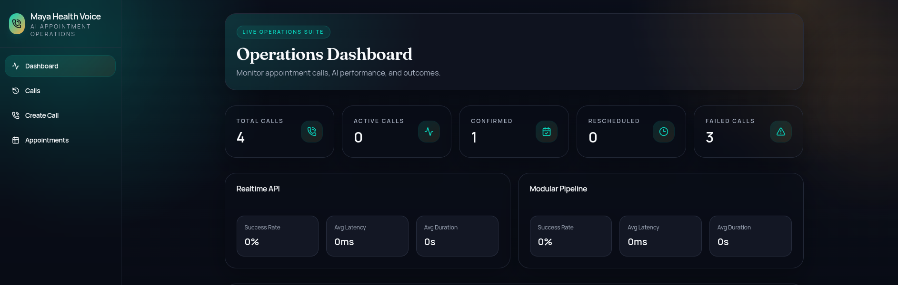
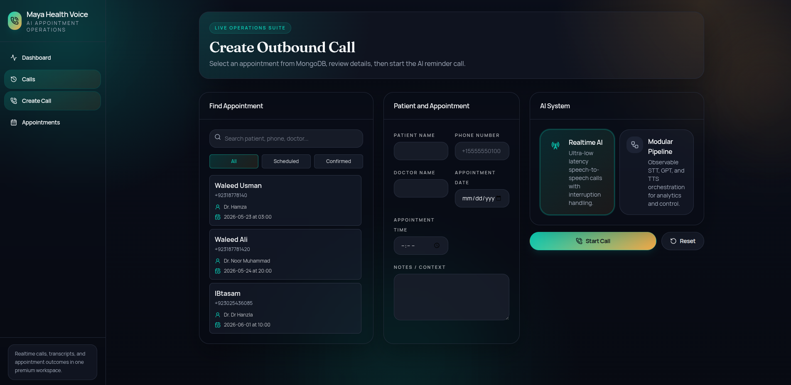
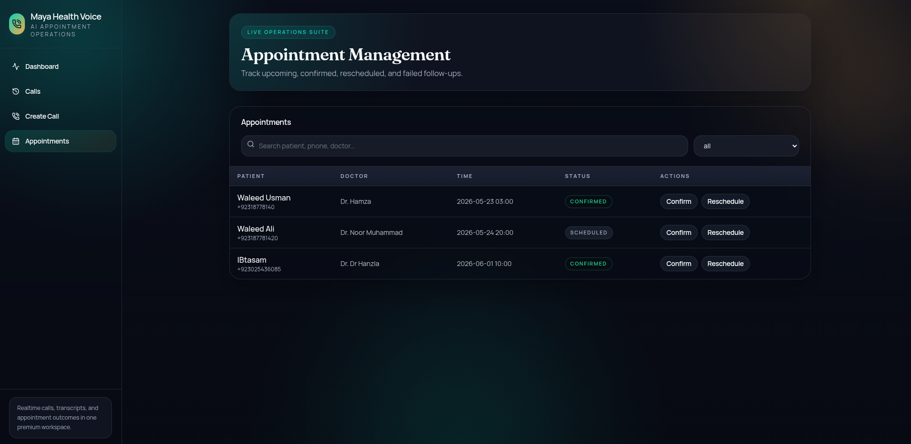
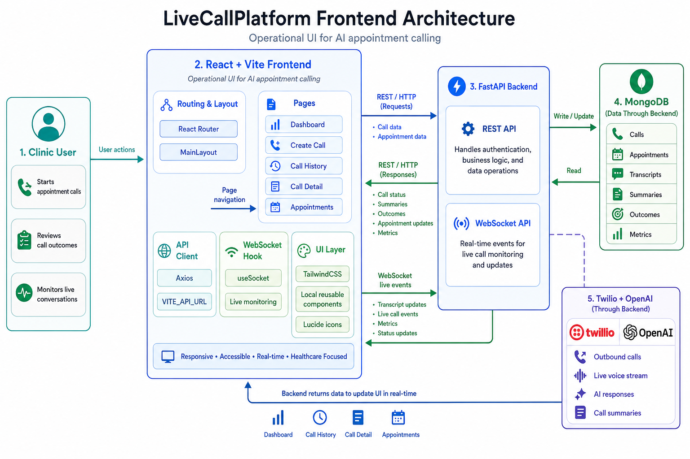

# LiveCallPlatform Frontend

React dashboard for managing AI-assisted healthcare appointment calls. The app gives clinic teams a focused workspace for launching calls, monitoring live conversations, reviewing transcripts, and tracking appointment outcomes.



> Add your main dashboard screenshot at `docs/images/dashboard.png`.

## Product Experience

LiveCallPlatform turns appointment calling into a clear operations workflow. The dashboard shows call volume and AI system performance, the create-call flow captures patient and appointment details, and the call detail screen brings together transcript, summary, outcome, latency, and live monitoring in one place.

The UI is built for clinic operators who need to move quickly: scan the current state, start the next call, identify failed or pending follow-ups, and understand what happened in every patient conversation without digging through raw provider logs.

## Screens

- **Dashboard**: call statistics, recent activity, and AI system analytics.
- **Create Call**: patient details, appointment context, and AI system selection.
- **Call History**: searchable call records with status, outcome, and timestamps.
- **Call Detail**: transcript, summary, appointment update, latency, and live monitor socket.
- **Appointments**: appointment management for confirmed, rescheduled, scheduled, failed, and pending follow-ups.

## UI Screenshots




## Architecture




The frontend is a Vite React application that communicates with the FastAPI backend over HTTP for standard dashboard actions and WebSockets for live call monitoring. API concerns are centralized in `src/api/client.js`, reusable socket behavior lives in `src/hooks/useSocket.js`, and route-level screens live in `src/pages`.

At a high level:

- React Router controls the dashboard, calls, call detail, create-call, and appointments pages.
- Axios sends REST requests to the backend API.
- WebSocket connections stream live transcript and call-monitoring events.
- TailwindCSS and local UI components keep the interface consistent across operational screens.

## Tech Stack

- React
- Vite
- TailwindCSS
- React Router
- Axios
- Lucide icons
- Local shadcn-style UI components

## Setup

Run these commands from the `frontend/` directory:

```bash
npm install
cp .env.example .env.local
npm run dev
```

The frontend runs at:

```text
http://localhost:5173
```

Configure the backend API URL in `.env.local`:

```env
VITE_API_URL=http://localhost:8000
```

## Scripts

```bash
npm run dev
npm run build
```

## Backend Connection

The frontend expects the backend to be available at `VITE_API_URL`. For local development, start the backend on `http://localhost:8000`, then start this app on `http://localhost:5173`.

Live monitoring uses the same base URL converted to WebSocket protocol. For example:

```text
http://localhost:8000 -> ws://localhost:8000
https://api.example.com -> wss://api.example.com
```
